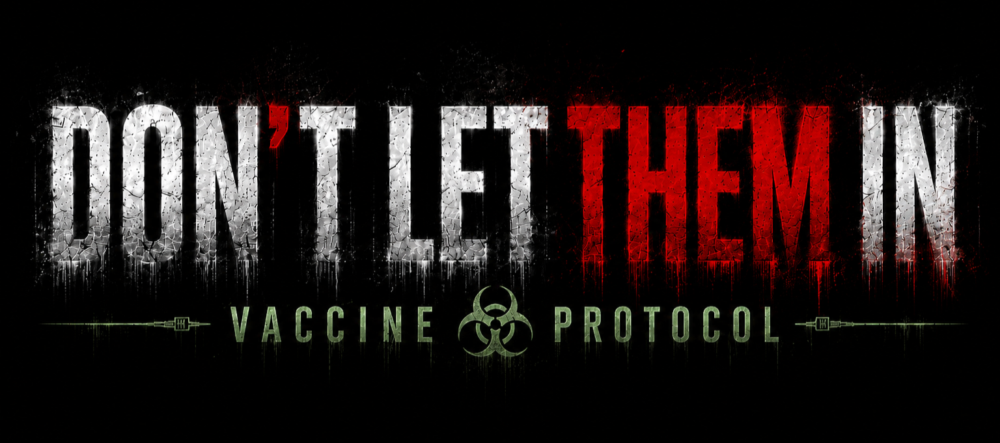
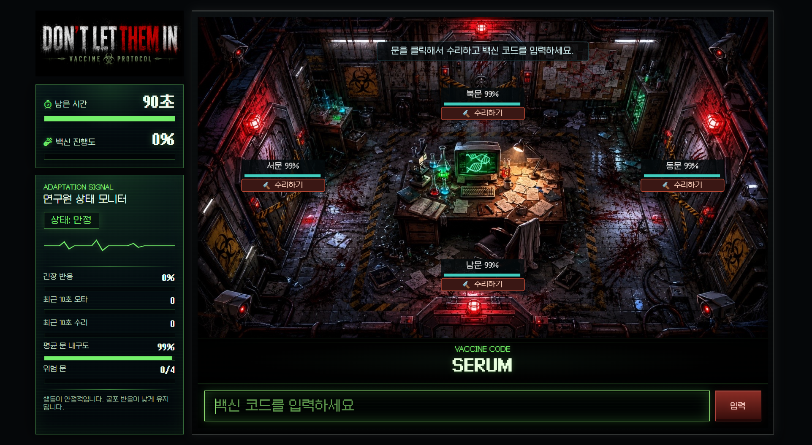

# 🧟 DON'T LET THEM IN

**DON'T LET THEM IN: Vaccine Protocol**은 좀비 바이러스가 퍼진 연구소에서 마지막 생존 연구원이 되어 백신을 완성하는 웹 미니게임이다. 플레이어는 네 방향의 격리문을 수리하면서 동시에 백신 코드를 입력해야 하며, 90초 안에 백신 진행도 100%를 달성하면 승리한다.

▶ **Play:** https://nayoniee.github.io/dont-let-them-in/

---

## 🧪 Game Overview

플레이어는 연구소 중앙의 백신 개발 장치로 백신을 개발하면서 북문, 동문, 서문, 남문을 관리한다. 시간이 지날수록 문 내구도는 감소하고, 문 하나라도 0%가 되면 연구소가 침입당해 즉시 게임오버가 된다.

백신 개발은 화면에 표시되는 영단어 코드를 정확히 입력하는 방식으로 진행된다. 정답을 입력할 때마다 백신 진행도가 4% 증가하며, 총 25개의 코드를 성공하면 백신이 완성된다.

## ☣️ Core Rules

- 플레이 시간: 90초
- 승리 조건: 백신 진행도 100% 달성
- 패배 조건: 문 하나라도 내구도 0% 도달
- 문 수리: 수리 버튼 클릭 시 해당 문 내구도 15% 회복
- 코드 입력 성공: 백신 진행도 4% 증가
- 코드 입력 실패: 오타 횟수 +1 및 경고음 재생

## Difficulty Progression

문 내구도 감소 속도는 시간에 따라 단계적으로 증가한다.

| Time | Door Decay |
| :--- | :--- |
| 0-30s | 3% / sec |
| 30-60s | 4% / sec |
| 60-90s | 5% / sec |

백신 코드는 `early`, `mid`, `late` 세 단계로 구성되어 있으며, 게임 시간이 지날수록 더 긴 단어가 등장한다.

## Adaptation System

본 게임은 플레이어의 최근 10초 행동 데이터를 기반으로 상태를 분류한다.

| State | Condition Summary | Game Response |
| :--- | :--- | :--- |
| Stable | 오타와 수리가 적고 문 내구도가 안정적일 때 | 한 단계 어려운 단어 제시 |
| Normal | 안정/과부하 조건에 해당하지 않을 때 | 현재 시간대 단어 제시 |
| Overload | 오타, 수리 빈도, 위험 문 수가 높을 때 | 한 단계 쉬운 단어 제시 + 강한 공포 연출 |

Adaptation은 난이도 완화와 공포 연출 강도 조절에 사용된다.

과부하 상태에서는 플레이어가 지속적으로 플레이할 수 있도록 단어 난이도는 완화되지만, 화면 흔들림, 붉은 화면 효과, 강한 문 두드림 소리로 공포 연출은 강화된다.

## Behavior Data

게임 종료 후 CSV 파일을 저장할 수 있다.

- `game_log.csv`: 플레이 중 발생한 이벤트별 상세 기록
- `game_summary.csv`: 한 판의 최종 결과를 1줄로 요약한 기록

측정 항목에는 수리 클릭 수, 클릭 간격, CPS, 오타 횟수, 백스페이스 수, 성공 코드 수, 문별 수리 횟수, 위험 상태 유지 시간, Adaptation 상태 변화 등이 포함된다.

## Endings

성공 시 백신 완성 엔딩이 표시되며, 실패 시 연구소 함락 엔딩이 표시된다.

## Tech Stack

- HTML
- CSS
- JavaScript
- p5.js
- GitHub Pages

## Project Period

- 기획 및 개발 기간: 2026.06.07 - 2026.06.22

## Project Purpose

본 프로젝트는 정서 게임 컴퓨팅의 정서 루프(Affective Loop) 4단계인 유발, 측정, 분류, 적응을 게임 시스템에 적용하고 실험하기 위해 제작되었다. 문 내구도 감소, 시간 압박, 문 두드림 소리, 공포 분위기의 배경 그래픽과 BGM으로 공포와 긴장 감정을 유발하고, 클릭 패턴, 오타, 문 방치 시간 등의 행동 데이터를 측정한다. 측정된 데이터를 바탕으로 플레이어 상태를 안정, 보통, 과부하로 분류하고, 단어 난이도와 공포 연출 강도를 조절하는 방식으로 적응 단계를 구현한다.
